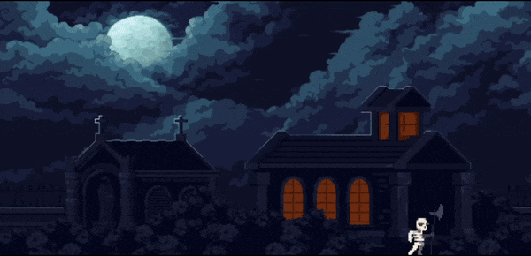

# maze-lightning
 
This simple project approximates the shape of lightning by generating a random maze using [Randomized_Prim's_algorithm](https://en.wikipedia.org/wiki/Maze_generation_algorithm#Randomized_Prim's_algorithm) and solving it using [breadth-first search](https://en.wikipedia.org/wiki/Breadth-first_search).

The app can be found here: https://immodal.github.io/maze-lightning/. Note: Mobile users may experience poor performance.

Art assets provided by these amazing folks:
* [Backgroud](https://anokolisa.itch.io/moon-graveyard)
* [Skeleton](https://jesse-m.itch.io/skeleton-pack)

  

Figure 1: Click to summon lightning

